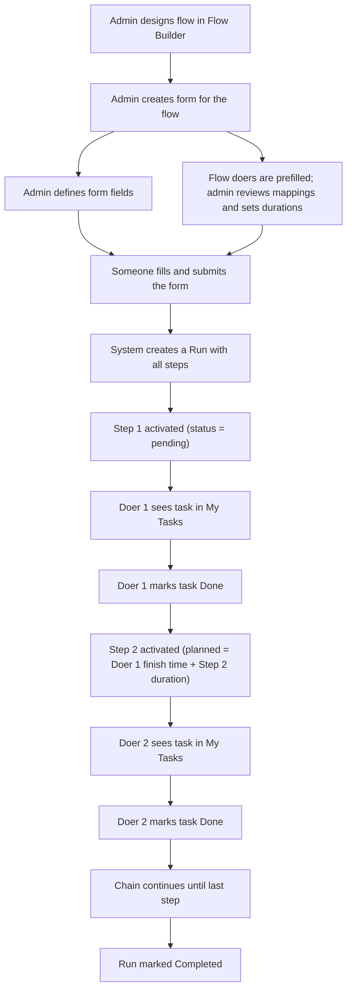
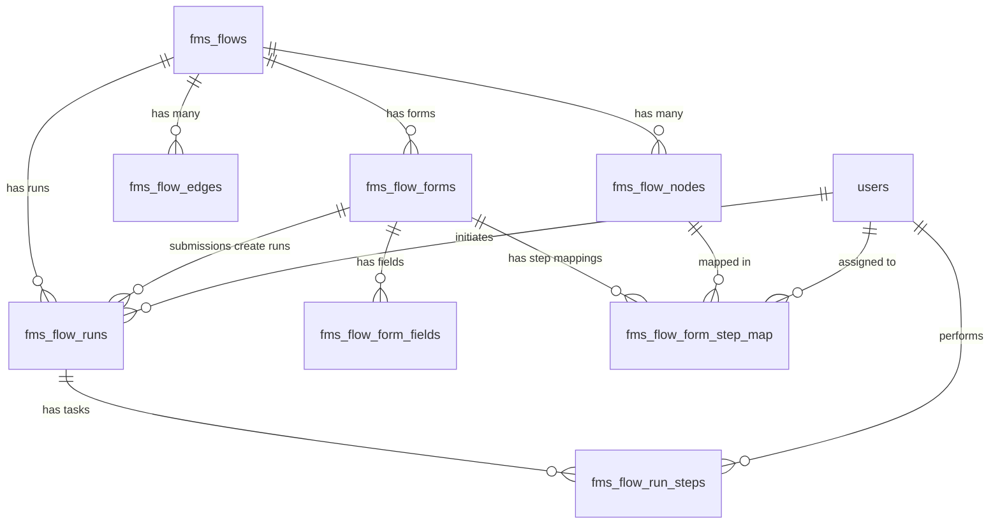

# FMS Form Builder + Task Execution Engine

## Table of Contents

1. [System Overview](#1-system-overview)
2. [MNP Example Setup](#2-mnp-example-setup)
3. [Database Schema (5 New Tables)](#3-database-schema-5-new-tables)
4. [Entity Relationship Diagram](#4-entity-relationship-diagram)
5. [How It Works (Phase by Phase)](#5-how-it-works-phase-by-phase)
6. [The Timing Model](#6-the-timing-model)
7. [Real-Time Execution Timeline](#7-real-time-execution-timeline)
8. [My Tasks -- What Each User Sees](#8-my-tasks----what-each-user-sees)
9. [Step Completion Engine](#9-step-completion-engine)
10. [Form Field CRUD](#10-form-field-crud)
11. [Implementation Roadmap](#11-implementation-roadmap)

---

## 1. System Overview

The system is built in three layers. Layer 1 (Flow Builder) already exists. Layers 2 and 3 are new.

**Layer 1 -- Flow Builder (Design-Time) -- Already Built**

The admin visually designs a workflow: steps, their order, roles, default doers, time rules, and validation rules. This produces a reusable blueprint stored in three existing tables (fms_flows, fms_flow_nodes, fms_flow_edges). The flow blueprint defines process structure and default ownership; runtime tasks are still not created at this stage.

**Layer 2 -- Form Builder (Bridge) -- New**

The admin creates a submission form attached to a specific flow. The form has two parts. First, input fields -- what data to collect when someone starts this workflow (for example, client name, news topic, priority). Second, step mapping review -- users are prefilled from flow-level doer definitions, while durations can be confirmed or adjusted per form. This is the bridge between the flow blueprint and real execution context.

**Layer 3 -- Execution Engine (Runtime) -- New**

When someone fills and submits the form, the engine creates a "run" -- one instance of the flow. It generates one task per step, assigns each to the mapped user, and activates them in sequence. As each doer completes their task, the next doer's task is immediately activated. Tasks appear in each user's "My Tasks" page in real-time.

---

## 2. MNP Example Setup

Throughout this document we use a concrete example: **MNP (Micro New Posting)** -- a workflow for researching, verifying, writing, posting, and cross-checking news content.

### The Flow Blueprint

The admin creates the MNP flow in the Flow Builder with 5 steps.
Duration is represented in **HH:MM** format in UI and docs, and converted to `duration_minutes` internally for calculations.

| Step | Step Name          | Role            | Default Duration |
|------|--------------------|-----------------|------------------|
| 1    | Research News      | researcher      | 04:00            |
| 2    | Approve Research   | manager         | 02:00            |
| 3    | Write Content      | editor          | 06:00            |
| 4    | Post to Social     | social_manager  | 01:00            |
| 5    | Cross-Check Post   | manager         | 02:00            |

Connected as: Start -> Research News -> Approve Research -> Write Content -> Post to Social -> Cross-Check Post -> End

### Team Members

| User   | Name           | System Role |
|--------|----------------|-------------|
| User 1 | John Smith     | admin       |
| User 2 | Sarah Johnson  | manager     |
| User 4 | Emily Davis    | doer        |
| User 5 | Alex Turner    | doer        |
| User 6 | Lisa Wong      | doer        |

### The Form

The admin creates a form for MNP with these input fields:

| Field            | Type        | Required | Options (if applicable)          |
|------------------|-------------|----------|----------------------------------|
| Client Name      | text        | Yes      | --                               |
| News Topic       | text        | Yes      | --                               |
| Reference Links  | textarea    | No       | --                               |
| Priority         | select      | Yes      | Normal, Urgent                   |
| Target Platforms | multiselect | Yes      | Twitter, LinkedIn, Instagram     |

And preloads flow-defined users for each step (admin can review/override if allowed):

| Step Name          | Assigned User  | Duration |
|--------------------|----------------|----------|
| Research News      | Emily Davis    | 04:00 |
| Approve Research   | Sarah Johnson  | 02:00 |
| Write Content      | Alex Turner    | 06:00 |
| Post to Social     | Lisa Wong      | 01:00 |
| Cross-Check Post   | Sarah Johnson  | 02:00 |

Sarah Johnson handles both manager steps (Approve Research and Cross-Check Post).

---

## 3. Database Schema (5 New Tables)

### 3.1 fms_flow_forms -- Form Definition

**Purpose:** One row per form. Links a form to a flow blueprint.

| Column      | Type         | Purpose                                                              |
|-------------|--------------|----------------------------------------------------------------------|
| id          | int, PK      | Unique identifier                                                    |
| flow_id     | int, FK      | Which flow blueprint this form belongs to                            |
| name        | varchar(255) | Display name shown to the person filling the form                    |
| description | text         | Optional instructions or context                                     |
| status      | enum         | draft (not yet usable), active (ready for submissions), inactive     |
| created_by  | int, FK      | Admin who created the form                                           |
| updated_by  | int, FK      | Last admin who edited the form                                       |
| created_at  | timestamp    | When the form was created                                            |
| updated_at  | timestamp    | When the form was last modified                                      |

**Why this table exists:** The flow blueprint defines the process (steps, order, roles). It does not define what input data to collect from the user who starts the workflow. This table is the container for that input definition. Separating form from flow means you can change the form without touching the flow design.

**MNP example:** One row with flow_id pointing to the MNP flow, name "MNP Submission Form", status "active".

---

### 3.2 fms_flow_form_fields -- Dynamic Form Fields

**Purpose:** One row per input field on the form. This is what the person filling the form sees and types into.

| Column        | Type         | Purpose                                                                            |
|---------------|--------------|-------------------------------------------------------------------------------------|
| id            | int, PK      | Unique identifier                                                                   |
| form_id       | int, FK      | Which form this field belongs to                                                    |
| field_key     | varchar(100) | Programmatic key used in stored JSON (e.g., "client_name"). Never changes.          |
| field_label   | varchar(255) | Display label the user sees (e.g., "Client Name"). Can be renamed freely.           |
| field_type    | enum         | What kind of input: text, textarea, number, date, select, multiselect, file, checkbox |
| options       | JSON         | For select/multiselect: the list of choices (e.g., ["Normal", "Urgent"])            |
| is_required   | boolean      | Whether the field must be filled to submit the form                                 |
| default_value | varchar(500) | Pre-filled value (optional)                                                         |
| placeholder   | varchar(255) | Hint text inside the empty input                                                    |
| sort_order    | int          | Controls the order fields appear on the form (1, 2, 3...)                           |
| created_at    | timestamp    | When the field was created                                                          |
| updated_at    | timestamp    | When the field was last modified                                                    |

**Why this table exists:** Each row is one form field. The admin can freely add, edit, delete, and reorder fields at any time without any code changes. The form UI renders dynamically from this table.

**Why field_key matters:** When someone submits the form, values are stored as JSON keyed by field_key (e.g., {"client_name": "TechCorp", "news_topic": "AI Chip"}). Even if the admin later renames the label from "Client Name" to "Customer Name", the stored data still uses "client_name" as the key and remains readable. The key is stable; the label is cosmetic.

**MNP example:** 5 rows -- one each for Client Name, News Topic, Reference Links, Priority, and Target Platforms.

---

### 3.3 fms_flow_form_step_map -- User-to-Step Assignment

**Purpose:** One row per executable step in the flow, storing the effective doer and time budget used by this form.

| Column         | Type         | Purpose                                                                    |
|----------------|--------------|----------------------------------------------------------------------------|
| id             | int, PK      | Unique identifier                                                          |
| form_id        | int, FK      | Which form this mapping belongs to                                         |
| node_id        | varchar(64), FK | Links to the specific step node in the flow blueprint                   |
| doer_id        | int, FK      | The real user who will perform this step                                   |
| duration_minutes | int | Expected duration in minutes (derived from HH:MM input, e.g., 04:00 -> 240) |
| sort_order     | int          | Execution sequence (1 = first step, 2 = second, etc.)                     |

**Why this table exists:** Doers are primarily defined in the flow, then prefilled into the form. This table stores the form-effective mapping used for execution, including any allowed overrides and duration values captured at form level.

**Why duration_minutes is here and not on the flow node:** The flow node can have a default planned duration. But the admin might want to override it per-form. For example, the same MNP flow could have a separate "Urgent" form where the research step gets 02:00 instead of 04:00. Duration is a per-form decision.

**Why sort_order:** This is the execution sequence computed from the flow's edges (topological order). The engine reads this to know which step to activate next when the current one completes.

**MNP example:** 5 rows mapping Research News to Emily (04:00), Approve Research to Sarah (02:00), Write Content to Alex (06:00), Post to Social to Lisa (01:00), Cross-Check Post to Sarah (02:00).

---

### 3.4 fms_flow_runs -- Flow Execution Instance

**Purpose:** One row per form submission. Each submission creates one independent execution of the flow.

| Column          | Type         | Purpose                                                                     |
|-----------------|--------------|-----------------------------------------------------------------------------|
| id              | int, PK      | Unique identifier                                                           |
| flow_id         | int, FK      | Which flow blueprint this run is based on                                   |
| form_id         | int, FK      | Which form was submitted to create this run                                 |
| run_title       | varchar(255) | A readable title (e.g., "MNP: AI Chip Launch")                             |
| form_data       | JSON         | Snapshot of all submitted form values at the time of submission             |
| status          | enum         | running, completed, cancelled, paused                                       |
| initiated_by    | int, FK      | The user who filled and submitted the form                                  |
| current_node_id | varchar(64)  | Pointer to the currently active step (updated as steps complete)            |
| started_at      | timestamp    | When the form was submitted and the run began                               |
| completed_at    | timestamp    | When the last step finished and the run ended (null while running)          |

**Why this table exists:** This is the "instance" of a flow. The flow is the template; this is the execution. If 10 different news stories are submitted, there are 10 rows here -- 10 independent runs of the same MNP flow, each with their own form data and their own progress.

**Why form_data is stored as JSON:** Snapshot preservation. Imagine the admin submits the form with client_name "TechCorp." Two weeks later, the admin deletes the "Client Name" field from the form definition. The old run should still show "TechCorp" because it was captured at submission time. The JSON snapshot is a permanent record of what was submitted, immune to future form changes.

**Why current_node_id:** Quick lookup. Instead of scanning all run steps to find which one is currently active, this pointer tells you immediately where the flow stands right now. Updated every time a step completes.

**MNP example:** One row with run_title "MNP: AI Chip Launch", form_data containing all the submitted values, status "running", current_node_id pointing to whichever step is active.

---

### 3.5 fms_flow_run_steps -- Actual Tasks Per User

**Purpose:** One row per step per run. This is what appears in each user's "My Tasks" page. This is the heart of the runtime engine.

| Column          | Type         | Purpose                                                                     |
|-----------------|--------------|-----------------------------------------------------------------------------|
| id              | int, PK      | Unique identifier                                                           |
| run_id          | int, FK      | Which run this task belongs to                                              |
| node_id         | varchar(64)  | Links back to the flow step definition                                      |
| step_name       | varchar(255) | Snapshot of the step name at creation time (won't change if flow is edited) |
| step_code       | varchar(100) | Snapshot of the step code for programmatic reference                        |
| doer_id         | int, FK      | The user assigned to perform this task                                      |
| status          | enum         | waiting, pending, in_progress, completed, skipped (see below)               |
| duration_minutes  | int | Expected duration in minutes (from HH:MM input)                              |
| planned_at      | datetime     | Planned completion timestamp (deadline) for the step                         |
| started_at      | datetime     | When the doer clicks "Start" (authoritative work start)                      |
| actual_at       | datetime     | When the doer clicks "Mark Done"                                            |
| sort_order      | int          | Execution order within the run                                              |
| comment         | text         | Optional notes the doer can leave when completing                           |
| attachment_path | varchar(500) | Optional file attachment                                                    |
| created_at      | timestamp    | When the task was created                                                   |
| updated_at      | timestamp    | When the task was last modified                                             |

**Status lifecycle:**

| Status      | Meaning                                                        | Visible in My Tasks |
|-------------|----------------------------------------------------------------|---------------------|
| waiting     | Not yet this user's turn. Previous steps have not completed.   | No                  |
| pending     | It is this user's turn. The step is active and its planned completion time is set.| Yes                 |
| in_progress | The doer has acknowledged and is actively working.             | Yes                 |
| completed   | The doer marked it done (actual_at set). Next step activated.  | No (moves to history)|
| skipped     | Admin skipped this step (if allowSkip was true on the node).   | No                  |

**Why step_name is stored here (duplicated from the flow node):** Snapshot preservation. If the admin later renames "Research News" to "News Investigation" in the flow builder, Emily's completed task should still say "Research News" because that is what it was called when she did it. The run step captures the name at creation time.

**Why planned_at, actual_at, and duration_minutes are separate columns and not JSON:** Because they need to be queried. "Show me all overdue tasks" requires comparing planned_at with the current time. "Show me average delay per step" requires measuring the difference between actual and planned. These queries cannot be done efficiently on JSON fields.

**MNP example at creation (right after form submission):**

| Step Name          | Doer   | Status  | Duration | Planned    | Actual |
|--------------------|--------|---------|----------|------------|--------|
| Research News      | Emily  | pending | 04:00    | 3:00 PM    | --     |
| Approve Research   | Sarah  | waiting | 02:00    | --         | --     |
| Write Content      | Alex   | waiting | 06:00    | --         | --     |
| Post to Social     | Lisa   | waiting | 01:00    | --         | --     |
| Cross-Check Post   | Sarah  | waiting | 02:00    | --         | --     |

Only Emily's task is pending with a planned_at deadline. All others are waiting and invisible to their doers.

---

## 4. Entity Relationship Diagram

### How the tables connect (in plain English)

- A **flow** has many **nodes** and **edges** (the blueprint).
- A **flow** can have one or more **forms** (input definitions).
- A **form** has many **form fields** (what to collect) and many **step mappings** (who does what).
- A **form** submission creates a **run** (one execution instance).
- A **run** has many **run steps** (the actual tasks assigned to real users).
- **Users** are assigned to steps via the step map, and perform tasks via run steps.

---

## 5. How It Works (Phase by Phase)

### Phase 1: Admin Designs the Flow (Already Built)

The admin opens the FMS Flow Builder and visually creates the MNP workflow. They drag in 5 step nodes between Start and End, name each step, set roles, configure time rules and validation rules, and save. The flow is stored in the existing flow tables. The admin marks the flow as "active."

**Result:** A reusable blueprint exists with step definitions and default doer assignments at flow level. Runtime tasks are still not created at this stage.

### Phase 2: Admin Creates a Form and Maps Users (New)

The admin opens the Form Builder for the MNP flow. Two things happen:

**Part A -- Define Input Fields.** The admin adds form fields that will be shown when someone starts this workflow: Client Name (text, required), News Topic (text, required), Reference Links (textarea, optional), Priority (select with Normal/Urgent, required), Target Platforms (multiselect with Twitter/LinkedIn/Instagram, required). These are saved as rows in fms_flow_form_fields.

**Part B -- Map Users to Steps.** The system reads the flow's step nodes and displays them in order. Doer selection is defined in the flow and the same users are prefilled in the form automatically. The admin can review (and optionally override, if allowed) and set the expected duration in HH:MM format. The backend converts HH:MM to `duration_minutes` before saving into fms_flow_form_step_map.

The admin marks the form as "active."

**Doer Rule:** Doer selection should be defined in flows first; thereafter, the same users are predefined in forms.

**Result:** The form is ready. Anyone with permission can now fill it to start a run.

### Phase 3: Form Submission Creates a Run (New)

A manager opens the MNP form page and fills in the fields: Client Name = "TechCorp Inc.", News Topic = "AI Chip Launch", Priority = "Urgent", Target Platforms = Twitter and LinkedIn. They click Submit.

The backend performs these operations in a single transaction:

1. **Creates the run.** One row in fms_flow_runs with the form data stored as a JSON snapshot, status "running", and the run title set to "MNP: AI Chip Launch."

2. **Creates all run steps.** The engine reads the step mappings from fms_flow_form_step_map (ordered by sort_order) and creates one fms_flow_run_steps row per step. The first step (Research News, Emily) gets status "pending" with planned_at set to run started time plus step-1 duration_minutes. All other steps get status "waiting" with planned_at left empty until they are activated.
3. **Applies start behavior.** `started_at` is not set at activation. It is set only when the doer clicks **Start**. If a doer clicks **Mark Done** without Start, the backend auto-sets `started_at = actual_at` to keep elapsed-time math valid.
4. **Sets the current node pointer.** The run's current_node_id is set to the first step's node.

**Result:** Emily immediately sees "Research News" in her My Tasks page.

### Phase 4: Real-Time Task Chain Execution (New)

The flow executes as a chain reaction. Each time a doer completes their task, the system activates the next one.

**Emily completes Research News.** Her step is marked "completed" with actual_at set to the current time. The system looks at the flow edges to find the next step: Approve Research (Sarah). Sarah's step is set to "pending" with planned_at set to Emily's actual_at plus Sarah's duration_minutes. The run's current_node_id is updated.

**Sarah approves.** Her step is completed. The system activates Write Content (Alex). Alex's planned_at is set to Sarah's actual_at plus Alex's duration_minutes.

**Alex writes content.** His step is completed. The system activates Post to Social (Lisa). Lisa's planned_at is set to Alex's actual_at plus Lisa's duration_minutes.

**Lisa posts.** Her step is completed. The system activates Cross-Check Post (Sarah again). Sarah's planned_at is set to Lisa's actual_at plus Cross-Check duration_minutes.

**Sarah cross-checks (final step).** Her step is completed. The system detects the next node is the End node. The run is marked "completed" with completed_at set to the current time.

**Result:** The entire MNP workflow is complete. Every step has a planned_at, actual_at, and duration recorded.

---

## 6. The Timing Model

Each run step tracks three timestamps and one duration:

| Field           | What It Represents                                      | When It Is Set                        |
|-----------------|---------------------------------------------------------|---------------------------------------|
| duration_minutes  | How long the admin expects this step to take            | At run creation (from the step map)   |
| planned_at      | When the task should be done by the doer                 | When previous step completes + duration of current step |
| started_at      | When work actually starts for that doer                  | When doer clicks "Start" (or auto-filled as actual_at if Start is skipped) |
| actual_at       | When the doer finishes and marks the task done          | When the doer clicks "Mark Done"      |

### How planned_at Is Determined

For the **first step**, planned_at equals the form submission timestamp plus the duration allotted to step 1 (run creation time baseline).

For **every subsequent step**, planned_at equals the actual_at of the immediately preceding step plus the duration of the current step. This creates a real-time chain: each doer's clock begins when the previous doer finishes.

### Delay Detection

A step is considered **delayed** when real time exceeds planned time, whether the step is completed or not.

- For open steps (`pending` / `in_progress`): delayed if `now > planned_at`
- For completed steps: delayed if `actual_at > planned_at`

For example:

- **Case 1:** If Emily's step has `planned_at = 11:00 AM`, and she finishes at `12:00 PM`, she is **01:00 delayed**.
- **Case 2:** If Emily's step has `planned_at = 11:00 AM`, and current time is `11:01 AM`, she is **00:01 delayed**.

In practical UI terms, delayed open tasks are shown as overdue.

### Duration vs Elapsed Time

- **Duration** (`duration_minutes`): Stored in minutes for calculations; entered/displayed as HH:MM.
- **Elapsed time**: The difference between started_at and actual_at. This is the real wall-clock time the doer took.
- **Delay**: actual_at minus planned_at. Positive means late. Negative means the doer finished early.

---

## 7. Real-Time Execution Timeline

Full timestamped walkthrough of MNP "AI Chip Launch":

| Time      | Event                                  | What Changes in the Database                                                      |
|-----------|----------------------------------------|-----------------------------------------------------------------------------------|
| 11:00 AM  | Admin submits MNP form for "AI Chip Launch" | Run created (status = running). Step 1 (Emily): pending, planned = 3:00 PM (11:00 + 04:00). Steps 2-5: waiting. |
| 11:00 AM  | Emily sees "Research News" in My Tasks | No change. Her query returns step 1 because status = pending and doer = Emily.    |
| 4:00 PM   | Emily clicks "Mark Done"              | Step 1: completed, actual = 16:00 (01:00 delayed vs planned 15:00). Step 2 (Sarah): pending, planned = 6:00 PM (16:00 + 02:00). Run: current node updated. |
| 4:00 PM   | Sarah sees "Approve Research" in My Tasks | No change. Her query now returns step 2.                                        |
| 5:50 PM   | Sarah approves, clicks "Mark Done"    | Step 2: completed, actual = 17:50 (00:10 early vs planned 18:00). Step 3 (Alex): pending, planned = 11:50 PM (17:50 + 06:00).      |
| 5:50 PM   | Alex sees "Write Content" in My Tasks | No change. His query now returns step 3.                                          |
| 11:40 PM  | Alex finishes writing, clicks "Mark Done" | Step 3: completed, actual = 23:40 (00:10 early vs planned 23:50). Step 4 (Lisa): pending, planned = 12:40 AM (23:40 + 01:00).  |
| 11:40 PM  | Lisa sees "Post to Social" in My Tasks | No change. Her query now returns step 4.                                         |
| 12:55 AM  | Lisa posts, clicks "Mark Done"        | Step 4: completed, actual = 00:55 (00:15 delayed vs planned 00:40). Step 5 (Sarah): pending, planned = 2:55 AM (00:55 + 02:00).    |
| 12:55 AM  | Sarah sees "Cross-Check Post" in My Tasks | No change. Her query now returns step 5.                                      |
| 3:10 AM   | Sarah verifies, clicks "Mark Done"    | Step 5: completed, actual = 03:10 (00:15 delayed vs planned 02:55). Run: status = completed, completed_at = 03:10.|

### Per-Doer Summary

| Doer   | Step               | Budget | Planned   | Finished  | Elapsed | Verdict  |
|--------|--------------------|--------|-----------|-----------|---------|----------|
| Emily  | Research News      | 04:00  | 3:00 PM   | 4:00 PM   | 05:00   | Delayed (01:00) |
| Sarah  | Approve Research   | 02:00  | 6:00 PM   | 5:50 PM   | 01:50   | Early (00:10) |
| Alex   | Write Content      | 06:00  | 11:50 PM  | 11:40 PM  | 05:50   | Early (00:10) |
| Lisa   | Post to Social     | 01:00  | 12:40 AM  | 12:55 AM  | 01:15   | Delayed (00:15) |
| Sarah  | Cross-Check Post   | 02:00  | 2:55 AM   | 3:10 AM   | 02:15   | Delayed (00:15) |

**Total elapsed:** 16:10. **Total budget:** 15:00. **Result:** Run consumed 01:10 more than total budget, and final step completed 00:15 after its planned_at.

---

## 8. My Tasks -- What Each User Sees

### What a Doer Sees (e.g., Emily the Researcher)

Emily opens "My Tasks." The system queries fms_flow_run_steps for her user ID where status is "pending" or "in_progress," ordered by planned_at.

She sees a task card:

> **MNP: AI Chip Launch**
> Step: Research News
> Client: TechCorp Inc. | Topic: AI Chip Launch
> Planned: Feb 23, 2026 03:00 PM
> Duration: 04:00
> Actions: [Start] [Mark Done]

The client name and topic come from the run's form_data JSON. This gives Emily full context about what she needs to research.

She also has a "History" tab showing all her completed tasks with planned, actual, and elapsed times.

### What a Manager Sees (e.g., Sarah Johnson)

Sarah sees two things:

**Her own tasks** -- same as any doer. When it is her turn (Approve Research or Cross-Check Post), the task appears in her My Tasks with the same card format.

**A manager dashboard** -- showing all running workflows she participates in:

| Run               | Current Step     | Current Doer | Run Status |
|-------------------|------------------|--------------|------------|
| AI Chip Launch    | Research News    | Emily Davis  | Running    |
| Election Update   | Write Content    | Alex Turner  | Running    |
| Product Review    | Cross-Check Post | Sarah Johnson| My Turn    |

This dashboard lets Sarah see the big picture -- where each run stands, who is currently working, and whether anything is overdue.

### What an Admin Sees

The admin sees everything: a full overview of all running workflows across all flows, with the ability to drill into any run and see its step-by-step timeline.

### Overdue Tasks

The system can identify overdue tasks by checking: for any task with status "pending" or "in_progress," if the current time exceeds planned_at, the task is overdue. These can be highlighted with a visual indicator (red badge, warning icon) on both the doer's My Tasks page and the manager dashboard.

---

## 9. Step Completion Engine

When a doer clicks "Mark Done," the backend executes the following logic:

**1. Validate.** Confirm the logged-in user is the assigned doer for this step. Confirm the step's status is "pending" or "in_progress" (not already completed or waiting).

**2. Check validation rules.** Load the original flow node's configuration. If the node required a comment, verify a comment was provided. If the node required an attachment, verify an attachment was uploaded.

**3. Complete this step.** Set the step's status to "completed" and actual_at to the current time. Save the doer's comment and attachment if provided.

**4. Resolve the next step safely.** Evaluate outgoing edges from the current node.

- If exactly one edge matches, continue to that node.
- If no edge matches, set run status to `paused` and flag "No valid next step".
- If multiple edges match, set run status to `paused` and flag "Ambiguous branch result".
- For linear flows, this always resolves to one next node.

**5. Is it the End node?** If the next node is the End node, the run is complete: set the run's status to "completed" and completed_at to the current time.

**6. If not the End node,** activate the next step: set its status to "pending" and planned_at to (the just-completed step's actual_at + next step duration_minutes). Update the run's current_node_id to point to the new active step.

**7. Enforce idempotency and concurrency safety.**

- Lock current run-step row before completion update (for example, `SELECT ... FOR UPDATE`).
- Update step with status guard (`WHERE status IN ('pending','in_progress')`) to prevent double completion.
- If update affects 0 rows because step is already completed, return success as idempotent response.
- Add DB uniqueness guard: one task per `(run_id, node_id)`.
- Keep indexes on `(doer_id, status, planned_at)` and `(run_id, sort_order)` for task and chain performance.

All of steps 3 through 6 happen inside a single database transaction. If any part fails, everything rolls back and the doer sees an error message.

### Error Cases

| Situation                                   | Response                                 |
|---------------------------------------------|------------------------------------------|
| User tries to complete someone else's step  | Error: "You are not assigned to this step"|
| Step is already completed or still waiting  | Error: "Step is not active"              |
| Comment required but not provided           | Error: "Comment is required for this step"|
| Attachment required but not provided        | Error: "Attachment is required"          |
| Database error during transaction           | Rollback; Error: "Failed to complete step"|
| Multiple branch edges evaluate true         | Run paused; Error: "Ambiguous branch result" |
| No branch edge evaluates true               | Run paused; Error: "No valid next step"       |

---

## 10. Form Field CRUD

Form fields (fms_flow_form_fields) are fully editable after creation. Here is how each operation affects existing runs:

**Add a new field.** A new row is inserted into fms_flow_form_fields. Existing runs are unaffected -- their form_data JSON simply does not have the new key, which is fine. New form submissions will include the new field.

**Edit a field (label, type, required, options).** The row is updated. Existing runs are unaffected -- their form_data JSON stored the original values using the stable field_key at submission time. The key does not change even if the label changes. New submissions see the updated label, type, and options.

**Delete a field.** The row is deleted. Existing runs are unaffected -- their form_data JSON still contains the old key and value as historical data. New submissions will not include the deleted field.

**Reorder fields.** The sort_order values are updated. Existing runs are unaffected. Only changes the display order on the form for new submissions.

### Why This Is Safe

The key design decision is that fms_flow_runs.form_data is a JSON snapshot taken at submission time. It captures the exact values the user entered, keyed by field_key. No matter what happens to the form definition later -- fields added, renamed, deleted, reordered -- the historical run data is preserved exactly as it was submitted.

---

## 11. Implementation Roadmap

Ordered list of what needs to be built. Each item depends on the previous ones.

### Step 1: Database Tables

Add the 5 new table definitions to the database schema file and create migration functions to handle upgrades on existing installations. All 5 tables (fms_flow_forms, fms_flow_form_fields, fms_flow_form_step_map, fms_flow_runs, fms_flow_run_steps) must exist before anything else can be built. Include unique/index constraints needed by runtime safety: unique `(run_id, node_id)` and indexes on `(doer_id, status, planned_at)` and `(run_id, sort_order)`.

### Step 2: Form Builder API

Create the backend API for form management. Endpoints needed: create a form for a flow, load a form with its fields and prefilled step mappings, update form metadata, delete a form, add/edit/delete/reorder form fields, and save effective step mappings with duration entered as HH:MM (converted to duration_minutes internally, with controlled override behavior). This API must be complete before the UI can be built.

### Step 3: Form Builder UI

Build the admin interface for creating and editing forms. The UI has three sections: form metadata (name, description), a fields list with add/edit/delete/reorder capabilities, and a step mapping table that shows each flow step with prefilled doer + duration input in HH:MM (and optional override controls). Optionally include a preview of what the submission form will look like.

### Step 4: Execution Engine API

Create the backend API for runtime operations. Endpoints needed: submit a filled form to create a run, load a run with all its steps and current state, list all runs (filtered by flow or status), mark a step as done (the chain-reaction trigger with idempotency), mark a step as started (sets started_at), cancel a running workflow, get active tasks for the logged-in user, and get completed task history.

### Step 5: Form Submission Page

Build the page where authorized users fill and submit a flow's form. The page dynamically renders fields from the form definition, validates required fields, submits to the execution engine, and shows a success message with a link to the new run.

### Step 6: My Tasks Integration

Modify the existing My Tasks page to include flow-based tasks alongside regular tasks. Doers see their active flow tasks with context from form_data (client name, topic, etc.) and action buttons (Start, Mark Done). Managers see the same plus a dashboard of all runs they participate in.

### Step 7: Manager Dashboard

Build a dedicated section showing all active runs the manager is involved in, the current step and who is working on it, a progress indicator (completed steps out of total steps), overdue task alerts, and the ability to drill into a run's full step-by-step timeline.
